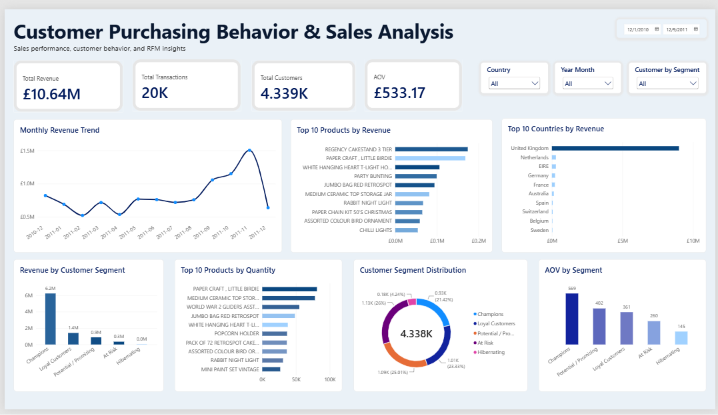

# Sales & Customer Analytics

A data analytics portfolio project focused on analyzing sales performance, customer behavior, product performance, and customer segmentation using RFM analysis.

## Project Overview

This project analyzes transactional data from an online retail company to understand sales performance and customer purchasing behavior.

The analysis covers the complete data analytics process, starting from data understanding and cleaning, followed by SQL analysis, customer analysis using RFM, and visualization through an interactive Power BI dashboard.

## Business Questions

This project aims to answer several business questions:

- How does revenue change over time?
- Which products contribute the most revenue and sales quantity?
- Which countries generate the highest revenue?
- Which customers contribute the most revenue?
- How are customers distributed across different RFM segments?
- Which customer segments have the highest monetary value?
- Which customers may be at risk of becoming inactive?

## Tools & Technologies

- Python
- Pandas
- SQL
- SQLite
- Power BI
- RFM Analysis
- Google Colab

## Dataset

The dataset used in this project is the Online Retail Dataset from the UCI Machine Learning Repository.

The dataset contains transactional information including:

- Invoice Number
- Stock Code
- Product Description
- Quantity
- Invoice Date
- Unit Price
- Customer ID
- Country

## Data Cleaning

The data cleaning process included:

- Removing duplicate transactions
- Identifying cancelled invoices
- Handling missing product descriptions
- Identifying missing Customer IDs
- Removing invalid unit prices from sales analysis
- Removing non-positive quantities from sales analysis
- Separating valid sales transactions from non-product transactions
- Creating a Revenue column from Quantity × Unit Price

After cleaning, the valid sales data contained 524,878 transaction line items.

## SQL Analysis

SQL was used to analyze:

- Total revenue
- Total transactions
- Total customers
- Average Order Value (AOV)
- Monthly revenue
- Top 10 products by revenue
- Top 10 products by quantity
- Top 10 customers by revenue
- Top 10 countries by revenue

## RFM Customer Analysis

RFM analysis was used to segment customers based on:

- Recency — how recently a customer made a purchase
- Frequency — how frequently a customer made purchases
- Monetary — how much revenue a customer generated

The customers were divided into five segments:

- Champions
- Loyal Customers
- Potential / Promising
- At Risk
- Hibernating

## Key Insights

Several important findings were identified:

1. Revenue increased significantly toward the end of the year, with November generating the highest monthly revenue.
2. Several products were major contributors to total revenue.
3. Champions represented around 21.42% of customers but contributed approximately 70.1% of RFM Monetary value.
4. 26% of customers were classified as At Risk, indicating a significant customer retention opportunity.
5. 25.01% of customers were classified as Potential / Promising, creating opportunities for cross-selling, upselling, and loyalty strategies.

## Power BI Dashboard



The final dashboard provides an interactive overview of sales performance and customer behavior.

Dashboard components include:

- Total Revenue
- Total Transactions
- Total Customers
- Average Order Value
- Monthly Revenue Trend
- Top 10 Products by Revenue
- Top 10 Products by Quantity
- Top 10 Countries by Revenue
- Top 10 Customers by Revenue
- Customer Segment Distribution
- Average Order Value by Customer Segment
- Revenue by Customer Segment
- Country filter
- Customer Segment filter
- Invoice Date filter

## Business Recommendations

Based on the analysis:

- Prepare inventory and promotional campaigns before peak sales periods.
- Prioritize high-performing products for inventory and promotion.
- Develop loyalty programs and exclusive offers for Champions.
- Implement win-back campaigns for At Risk customers.
- Use cross-selling and upselling strategies to develop Potential / Promising customers.

## Project Structure

```text
Sales-Customer-Analytics/
│
├── data/
│   └── rfm_customer.csv
│
├── notebook/
│   └── 01_data_understanding.ipynb
│
├── SQL/
│   └── sales_analysis.sql
│
├── README.md
├── Sales_Customer_Analytics.pbix
└── dashboard_preview.png
